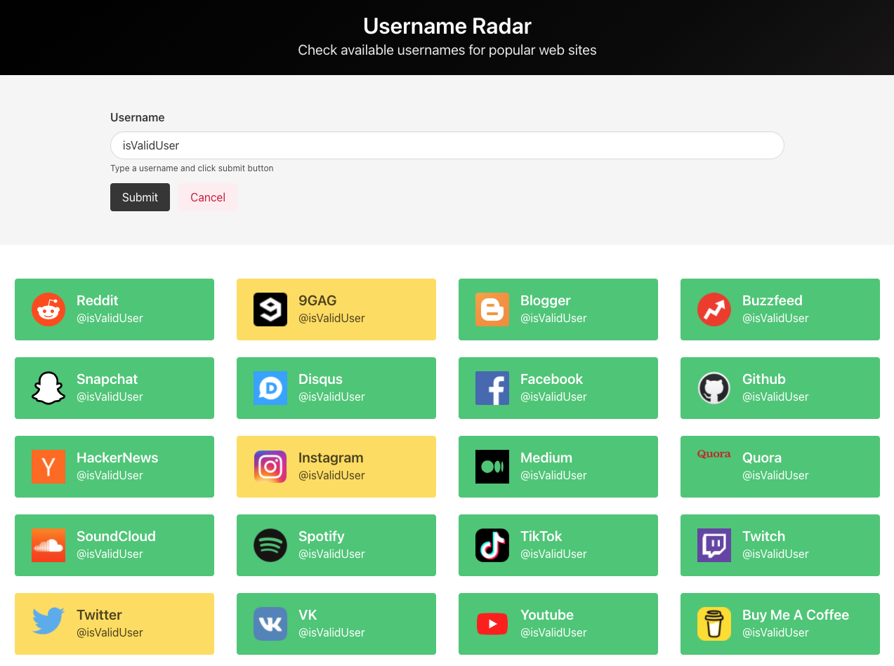

# Username - Scanner

Username - Scanner searches popular web sites to find out that username is available or not. 
Green color indicates that given username is available, yellow color indicates that username is taken.

## Feauteres

* Elegant, Simple UI
* Responsive Design
* Fast Search
* 20 Popular Web Sites
* Coloured Results

## Tech Stack

* Java 11 - Spring Boot API
* Web Socket Connection
* Vue
* Vuex
* Buefy UI Components

## Author

[Erdi Doğan](https://www.linkedin.com/in/doganerdi)

## License

This project is licensed under the MIT License 

